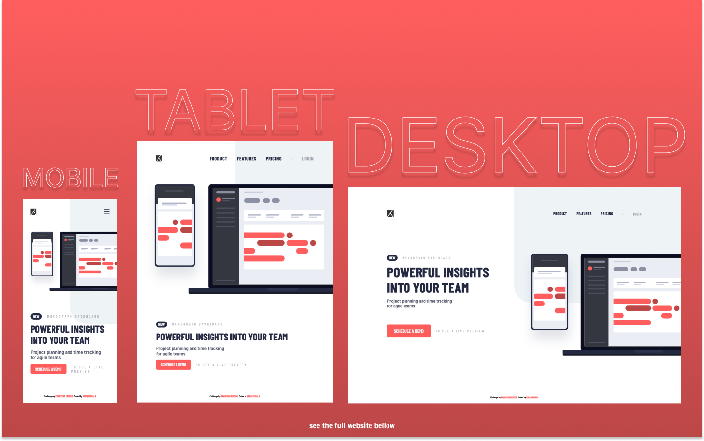

# Frontend Mentor - Project Tracking Intro Component Solution

This is a solution to the [Project Tracking Intro Component Challenge on Frontend Mentor](https://www.frontendmentor.io/challenges/project-tracking-intro-component-5d289097500fcb331a67d80e).

## Table of contents

- [Overview](#overview)
  - [The challenge](#the-challenge)
  - [Screenshot](#screenshot)
  - [Links](#links)
- [My process](#my-process)
  - [Built with](#built-with)
  - [What I learned](#what-i-learned)
  - [Useful resources](#useful-resources)
- [Author](#author)

## Overview

### The challenge

Users should be able to:

- View the optimal layout for the site depending on their device's screen size
- See hover states for all interactive elements on the page
- Create the background shape using code

### Screenshot

### Links

- Live Site URL: [https://kens-visuals.github.io/project-tracking-intro-component/](https://kens-visuals.github.io/project-tracking-intro-component/)
- Solution URL: [TO_BE_UPDATED](TO_BE_UPDATED)

## My process

### Built with

- Semantic HTML5 markup
- SCSS custom properties
- CSS Flexbox
- CSS Grid
- CSS Animations
- Vanilla JS
- Mobile-first workflow

### What I learned

In the [Blogr Landing Page](https://kens-visuals.github.io/blogr-landing-page/), there were sections similar to this project. The image was slightly out of the screen and when I was first implementing it, the part was a bit frustrating for me. However, that experience helped me to build this project a lot faster and a lot cleaner. This was the last small project of this level, the rest are whole landing pages. And I've got only 5 projects left to finish this level completely. I'm going to finish them by the end of the year.

### Useful resources

- [animista](https://animista.net/play/attention/blink/blink-2) - In case if you were wondering, I got the blink animation from here. Yes, I was pretty lazy to make one by myself.
- [CSS Box Shadows](https://getcssscan.com/css-box-shadow-examples) - My go to place for some cool CSS box-shadows.

## Author

- Frontend Mentor - [@kens-visuals](https://www.frontendmentor.io/profile/kens-visuals)
- Codewars - [@kens_visuals](https://www.codewars.com/users/kens_visuals)
- CodePen - [@kens-visuals](https://codepen.io/kens-visuals)
